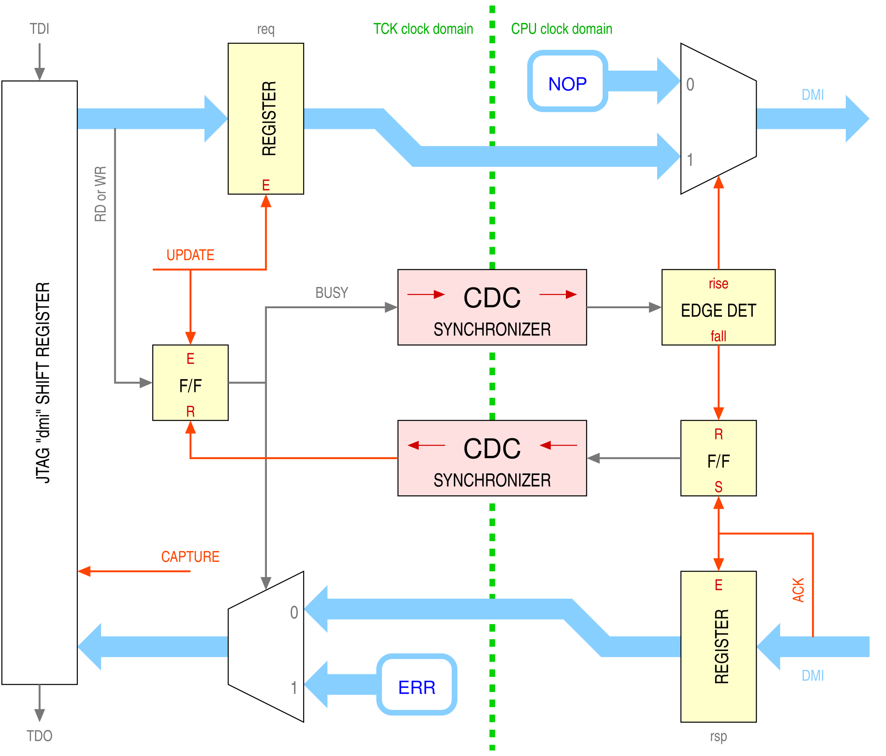

# FPGADebug

This repository contains the implementation of an alternative Debug Transport Module (DTM)
for the [NEORV32](https://github.com/stnolting/neorv32) open-source RISC-V processor written in VHDL.

This implementation is a drop-in replacement that adds the following features:

 - it is specifically tailored to AMD Artix-7 FPGAs or similar,
   using BSCANE2 primitives to access the on-silicon JTAG access port,
   and thus enabling debugging of the softcore using the same JTAG interface used for FPGA configuration;

 - it is a dual-clock-domain design, decoupling the TCK clock from the CPU clock,
   allowing JTAG to be either faster or slower than the CPU clock.
   This allows debugging of systems that perform dynamic frequency scaling,
   and also allows much faster transfer speeds (up to 2.5× those of the original implementation)
   by removing the constraint on TCK frequency < ⅕ CPU frequency.

It was developed and tested against version 1.13.2 of NEORV32 on a Digilent Cmod A7-35T FPGA module.

## Usage

Simply replace the original `neorv32_debug_dtm.vhd` with the one provided here.
JTAG connections are still present for compatibility but are not internally connected
as the signals are routed through BSCANE2 primitives.

A sample [OpenOCD](https://openocd.org/) configuration file is also included for convenience
showing how the instruction register values are allocated to the BSCANE2 primitives.

## Structure

The hard part of this implementation is the separation of the clock domains,
with the need to synchronize the bi-directional DMI bus connecting the two.

A simplified diagram of the ciruit structure is shown below,
and can be used to help understand the VHDL code.
Please refer to the cited references for more information.

## References

1. Giorgio Biagetti and Lorenzo Fabiani,
   “An FPGA-Proven VHDL Implementation of a Fast Debug Transport Module for the NEORV32 RISC-V Softcore”,
   presented at the
   *Applications in Electronics Pervading Industry, Environment and Society*
   *(ApplePies 2026)*,
   Bologna, Italy, 10–11 September 2026.

2. Lorenzo Fabiani,
   “FPGA implementation of RISC-V CPUs and interfacing to peripherals”,
   BSc thesis, Università Politecnica delle Marche,
   Ancona, Italy, July 2026.
   https://tesi.univpm.it/handle/20.500.12075/27310
